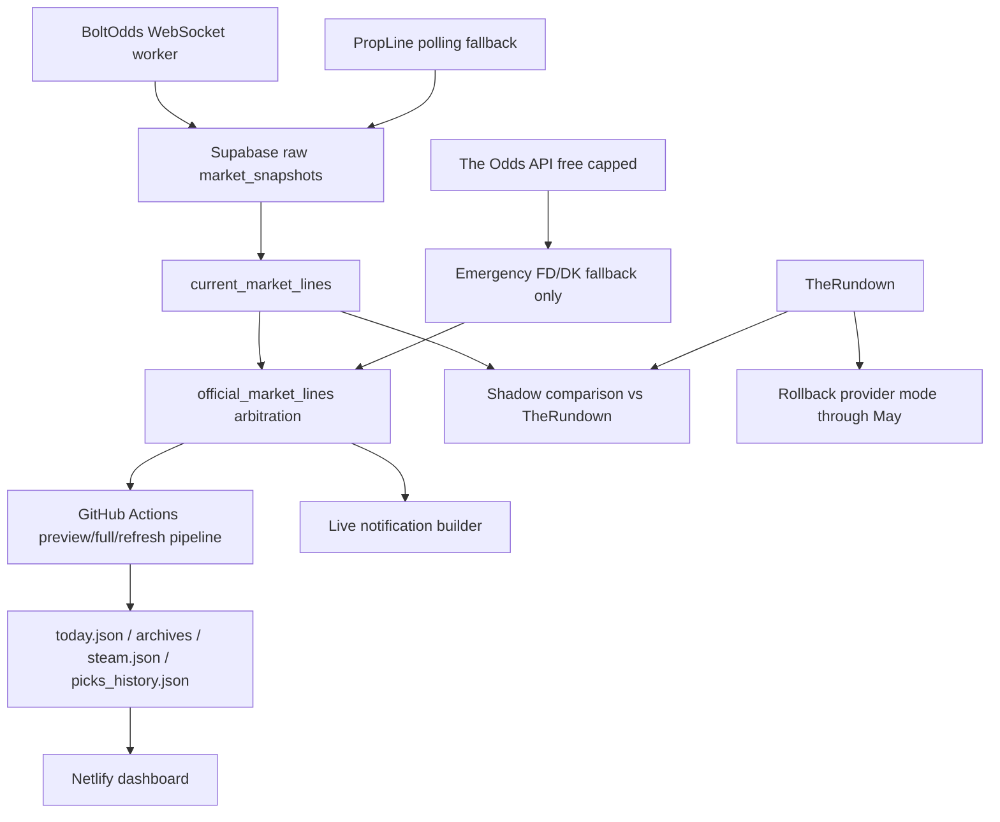

# BoltOdds + PropLine Official Provider Cutover Plan

Date: 2026-05-13
Owner: Tyler + Codex
Status: Draft implementation plan

## Goal

Promote BoltOdds from shadow-only live movement evidence into the primary
official market feed, with PropLine as the production fallback and DraftKings
coverage source, while keeping TheRundown available for audit and rollback
through the end of May 2026.

The cutover must be clean, reversible, and evidence-driven:

- Build the market infrastructure while TheRundown is still paid and available.
- Run BoltOdds + PropLine against TheRundown for at least 1-2 slates.
- Cut over official preview/full/refresh odds only after coverage, freshness,
  output compatibility, and rollback gates pass.
- Cut over live notifications separately after the official market state is
  trustworthy.
- Preserve the existing model math, thresholds, staking, calibration, and
  formula regime.

## Non-Goals

- Do not change EV thresholds, staking, calibration math, lambda/projection
  math, or `formula_change_date`.
- Do not make BoltOdds automatic betting logic.
- Do not remove TheRundown code until after the new provider stack has completed
  a successful production slate and the May renewal window is no longer needed
  for rollback.
- Do not broaden The Odds API beyond capped emergency fallback behavior.
- Do not make live notifications noisier; late alerts must remain fewer, better,
  and actionable.

## Double-Check Findings Before Writing This Plan

The current codebase is not missing provider shadowing, but it is missing the
official-market bridge needed for a safe cutover.

Important current-state findings:

- `codex/boltodds-production-plan` does not contain the working BoltOdds worker
  code or BoltOdds Supabase migration from `codex/boltodds-starter-trial`.
- `pipeline/fetch_odds.py` still treats TheRundown as primary and PropLine /
  The Odds API as fallbacks.
- `data/preview_lines.json`, `steam.json`, locked pick persistence, and
  `picks_history.json` all depend on the current `fetch_odds` output shape.
- `scripts/build_live_events_to_supabase.py` reads BoltOdds for shadow
  evidence/display, but production movement notifications currently only use
  `propline` as a movement provider.
- `market_infra/live_market_display.py` and `market_infra/market_evidence.py`
  understand `boltodds`, but they produce per-provider shadow reads, not an
  official consensus line.
- Existing Supabase raw tables store snapshots, but the official pipeline needs
  auditable current-line and arbitration tables before replacing TheRundown.
- PropLine Hobby at 5,000 requests/day is likely enough for fallback/polling,
  but request accounting must be measured from real run rows before downgrade.
- TheRundown just renewed and remains available through the end of May, which
  creates a useful overlap window for audit and rollback.

## Architecture After Cutover



Official market priority after promotion:

1. BoltOdds for fresh real-time line movement and all covered target books.
2. PropLine for DraftKings and any book/line missing or stale in BoltOdds.
3. The Odds API free plan only for emergency FanDuel/DraftKings coverage gaps.
4. TheRundown audit/rollback during May overlap, then retired from normal spend
   after the cutover proves out.

## Target Books And Ref-Book Priority

Supported production books:

- FanDuel
- DraftKings
- BetMGM
- BetRivers
- Caesars

Optional / shadow-only:

- Kalshi, until Tyler explicitly wants it treated as a primary actionable book.
- theScore Bet, because current BoltOdds coverage has not proven it.

Recommended ref-book priority for official picked lines:

```python
REF_BOOK_NAME_PRIORITY = [
    "FanDuel",
    "DraftKings",
    "BetMGM",
    "BetRivers",
    "Caesars",
]
```

Reasoning:

- FanDuel remains the familiar default if available.
- DraftKings must stay actionable through PropLine fallback.
- BetMGM, BetRivers, and Caesars are useful mainstream backups.
- Kalshi should not quietly become the ref book for a pitcher K bet unless the
  product intentionally supports it as an actionable bet surface.

## New Supabase Tables

Add one migration on the main branch after integrating the BoltOdds trial
migration.

File:

```text
supabase/migrations/20260513_provider_cutover_market_state.sql
```

Schema:

```sql
create table if not exists current_market_lines (
  id bigserial primary key,
  slate_date date not null,
  provider text not null check (provider in ('boltodds', 'propline', 'the_odds', 'therundown')),
  book_key text not null,
  book_name text not null,
  event_id text,
  provider_event_id text,
  player_name text not null,
  normalized_player_name text not null,
  market_key text not null default 'pitcher_strikeouts',
  line numeric not null,
  over_odds integer,
  under_odds integer,
  over_snapshot_id bigint,
  under_snapshot_id bigint,
  first_seen_at timestamptz,
  last_seen_at timestamptz not null,
  source_run_id uuid,
  is_complete boolean not null default false,
  freshness_seconds integer,
  quality_flags jsonb not null default '[]'::jsonb,
  raw_payload jsonb not null default '{}'::jsonb,
  inserted_at timestamptz not null default now(),
  updated_at timestamptz not null default now(),
  unique (slate_date, provider, book_key, normalized_player_name, market_key, line)
);

create index if not exists idx_current_market_lines_slate_provider
  on current_market_lines (slate_date, provider, updated_at desc);

create index if not exists idx_current_market_lines_player
  on current_market_lines (slate_date, normalized_player_name, market_key);

create table if not exists official_market_lines (
  id bigserial primary key,
  slate_date date not null,
  normalized_player_name text not null,
  player_name text not null,
  market_key text not null default 'pitcher_strikeouts',
  ref_book_key text,
  ref_book_name text,
  ref_line numeric,
  ref_over_odds integer,
  ref_under_odds integer,
  selected_provider text check (selected_provider in ('boltodds', 'propline', 'the_odds', 'therundown')),
  selected_source text not null,
  book_odds jsonb not null default '{}'::jsonb,
  provider_coverage jsonb not null default '{}'::jsonb,
  arbitration_reasons jsonb not null default '[]'::jsonb,
  quality_flags jsonb not null default '[]'::jsonb,
  freshness_seconds integer,
  stale_after_seconds integer not null default 900,
  current_market_line_ids jsonb not null default '[]'::jsonb,
  ready_for_pipeline boolean not null default false,
  inserted_at timestamptz not null default now(),
  updated_at timestamptz not null default now(),
  unique (slate_date, normalized_player_name, market_key)
);

create index if not exists idx_official_market_lines_slate_ready
  on official_market_lines (slate_date, ready_for_pipeline, updated_at desc);

create table if not exists market_opening_baselines (
  id bigserial primary key,
  slate_date date not null,
  normalized_player_name text not null,
  player_name text not null,
  market_key text not null default 'pitcher_strikeouts',
  book_key text not null,
  book_name text not null,
  line numeric not null,
  opening_over_odds integer,
  opening_under_odds integer,
  opening_provider text not null check (opening_provider in ('boltodds', 'propline', 'the_odds', 'therundown')),
  opening_source text not null,
  first_seen_at timestamptz not null,
  source_line_id bigint,
  inserted_at timestamptz not null default now(),
  unique (slate_date, normalized_player_name, market_key, book_key, line)
);

create index if not exists idx_market_opening_baselines_slate
  on market_opening_baselines (slate_date, normalized_player_name, book_key);

create table if not exists provider_arbitration_decisions (
  id bigserial primary key,
  slate_date date not null,
  normalized_player_name text not null,
  market_key text not null default 'pitcher_strikeouts',
  selected_provider text,
  selected_book_key text,
  selected_line numeric,
  decision text not null,
  reasons jsonb not null default '[]'::jsonb,
  candidate_count integer not null default 0,
  stale_candidate_count integer not null default 0,
  missing_book_keys jsonb not null default '[]'::jsonb,
  source_line_ids jsonb not null default '[]'::jsonb,
  inserted_at timestamptz not null default now()
);

create index if not exists idx_provider_arbitration_decisions_slate
  on provider_arbitration_decisions (slate_date, inserted_at desc);

create table if not exists provider_request_usage_daily (
  usage_date date not null,
  provider text not null,
  request_count integer not null default 0,
  snapshot_count integer not null default 0,
  source text not null,
  inserted_at timestamptz not null default now(),
  updated_at timestamptz not null default now(),
  primary key (usage_date, provider, source)
);
```

Why these tables are needed:

- `current_market_lines` turns noisy over/under snapshots into complete book
  lines.
- `official_market_lines` is the auditable feed the GitHub pipeline can consume.
- `market_opening_baselines` replaces TheRundown-dependent opening baselines
  while preserving `preview_lines.json` behavior.
- `provider_arbitration_decisions` makes skip/fallback/source decisions
  inspectable.
- `provider_request_usage_daily` protects the PropLine Hobby downgrade and
  catches cost creep.

## Provider Environment Flags

Add these to GitHub Actions and Render, but keep production defaults
conservative until cutover:

```text
OFFICIAL_MARKET_SOURCE=therundown
OFFICIAL_MARKET_SOURCE_FALLBACK=propline
OFFICIAL_MARKET_STALE_AFTER_SECONDS=900
ENABLE_BOLTODDS_PIPELINE_SOURCE=false
ENABLE_BOLTODDS_LIVE_NOTIFICATIONS=false
ENABLE_PROVIDER_ARBITRATION_SHADOW=true
PROPLINE_DAILY_REQUEST_BUDGET=5000
```

Allowed `OFFICIAL_MARKET_SOURCE` values:

- `therundown`
- `shadow_compare`
- `boltodds_propline`

Meaning:

- `therundown`: current behavior, with shadow comparison allowed.
- `shadow_compare`: current behavior for artifacts, plus a would-have-used
  BoltOdds/PropLine comparison report.
- `boltodds_propline`: official pipeline consumes `official_market_lines`.

Rollback is an environment switch back to:

```text
OFFICIAL_MARKET_SOURCE=therundown
ENABLE_BOLTODDS_PIPELINE_SOURCE=false
ENABLE_BOLTODDS_LIVE_NOTIFICATIONS=false
```

## Implementation Steps

### Step 1: Integrate The BoltOdds Trial Infrastructure Into Main

Bring the working trial branch pieces onto the planning branch:

- `scripts/boltodds_shadow_worker.py`
- `market_infra/boltodds_client.py`
- `market_infra/boltodds_normalizer.py`
- BoltOdds tests
- BoltOdds Supabase provider constraint migration
- Render worker docs/config notes

Commands:

```powershell
git status --short
git fetch origin
git checkout codex/boltodds-production-plan
git cherry-pick c77743f6
python -m pytest tests/test_boltodds_shadow_worker.py tests/test_boltodds_normalizer.py -v
```

Acceptance:

- The main planning branch has the fresh-slate rotation fix from the trial
  branch.
- BoltOdds remains shadow-only after the merge.
- Existing full test suite still passes.

### Step 2: Add Current Market Line Builder

Create:

```text
market_infra/current_market_lines.py
scripts/build_current_market_lines_to_supabase.py
tests/test_current_market_lines.py
```

Core behavior:

- Read raw `market_snapshots` joined to `market_provider_runs`.
- Keep only `slate_date`, `market_key=pitcher_strikeouts`, and supported books.
- Pair Over and Under rows from the same provider/book/player/line.
- Mark rows incomplete if either side is missing.
- Compute per-book freshness from the latest side snapshot.
- Upsert `current_market_lines`.
- Insert or preserve first-seen rows in `market_opening_baselines`.

Implementation shape:

```python
SUPPORTED_BOOK_KEYS = {
    "fanduel",
    "draftkings",
    "betmgm",
    "betrivers",
    "caesars",
}

def build_current_market_lines(snapshot_rows, run_rows, now_utc, stale_after_seconds=900):
    run_by_id = {row["id"]: row for row in run_rows}
    grouped = {}

    for snapshot in snapshot_rows:
        run = run_by_id.get(snapshot.get("run_id"))
        if not run:
            continue
        if snapshot.get("market_key") != "pitcher_strikeouts":
            continue
        book_key = normalize_book_key(snapshot.get("book_key") or snapshot.get("book_name"))
        if book_key not in SUPPORTED_BOOK_KEYS:
            continue
        key = (
            run["slate_date"],
            snapshot["provider"],
            book_key,
            normalize_name(snapshot["player_name"]),
            snapshot["market_key"],
            float(snapshot["line"]),
        )
        grouped.setdefault(key, []).append(snapshot)

    lines = []
    for key, rows in grouped.items():
        over = latest_side(rows, "over")
        under = latest_side(rows, "under")
        latest_seen = max(parse_ts(row["captured_at"]) for row in rows)
        freshness_seconds = int((now_utc - latest_seen).total_seconds())
        lines.append({
            "slate_date": key[0],
            "provider": key[1],
            "book_key": key[2],
            "normalized_player_name": key[3],
            "market_key": key[4],
            "line": key[5],
            "over_odds": over.get("odds") if over else None,
            "under_odds": under.get("odds") if under else None,
            "over_snapshot_id": over.get("id") if over else None,
            "under_snapshot_id": under.get("id") if under else None,
            "last_seen_at": latest_seen.isoformat(),
            "is_complete": bool(over and under),
            "freshness_seconds": freshness_seconds,
            "quality_flags": build_line_quality_flags(over, under, freshness_seconds, stale_after_seconds),
        })

    return lines
```

Tests:

- Complete Over/Under pairs become `is_complete=true`.
- Single-sided rows become `is_complete=false`.
- Older book rows are stale by `freshness_seconds`.
- Unsupported books are ignored.
- The same player at two different K lines remains two separate current rows.
- A new fresh row updates `current_market_lines` but does not overwrite the
  opening baseline.

### Step 3: Add Official Market Arbitration

Create:

```text
market_infra/official_market_lines.py
tests/test_official_market_lines.py
```

Core rules:

- Select only complete lines unless no complete line exists for a player.
- Prefer BoltOdds when fresh for a supported book.
- Use PropLine when BoltOdds is missing DraftKings, stale for a book, or missing
  the player/line entirely.
- Use The Odds API only when both BoltOdds and PropLine cannot supply
  FanDuel/DraftKings coverage and the capped emergency mode is explicitly
  enabled.
- Do not select stale lines for official pipeline output.
- Do not select a player with no supported book line.
- Preserve all available supported-book odds in `book_odds`.
- Write one `provider_arbitration_decisions` row per player per run.

Implementation shape:

```python
REF_BOOK_PRIORITY = ("fanduel", "draftkings", "betmgm", "betrivers", "caesars")
PRIMARY_PROVIDER = "boltodds"
FALLBACK_PROVIDER = "propline"

def choose_official_lines(current_lines, now_utc, stale_after_seconds=900):
    by_player = group_by_player(current_lines)
    official = []
    decisions = []

    for player_key, rows in by_player.items():
        fresh_complete = [
            row for row in rows
            if row["is_complete"] and row["freshness_seconds"] <= stale_after_seconds
        ]
        if not fresh_complete:
            decisions.append(skip_decision(player_key, rows, "no_fresh_complete_line"))
            continue

        book_odds = {}
        coverage = {}
        for book_key in REF_BOOK_PRIORITY:
            selected = select_book_line(fresh_complete, book_key)
            if selected:
                book_odds[selected["book_name"]] = {
                    "line": selected["line"],
                    "over": selected["over_odds"],
                    "under": selected["under_odds"],
                    "provider": selected["provider"],
                    "current_market_line_id": selected["id"],
                }
                coverage[book_key] = selected["provider"]

        ref = first_ref_book(book_odds, REF_BOOK_PRIORITY)
        if not ref:
            decisions.append(skip_decision(player_key, rows, "no_supported_ref_book"))
            continue

        official.append(build_official_row(player_key, ref, book_odds, coverage))
        decisions.append(use_decision(player_key, ref, book_odds, coverage))

    return official, decisions
```

Tests:

- Fresh BoltOdds FanDuel beats fresh PropLine FanDuel.
- PropLine DraftKings is used when BoltOdds has no DraftKings.
- Stale BoltOdds is rejected in favor of fresh PropLine.
- A player with only Kalshi is skipped.
- A player with one-sided Over only is skipped.
- Conflicting lines are preserved in `book_odds`, but the ref book follows
  priority.
- Decision rows explain missing, stale, and selected providers.

### Step 4: Add Pipeline Adapter Behind A Feature Flag

Create:

```text
pipeline/fetch_provider_market_odds.py
tests/test_fetch_provider_market_odds.py
```

Modify:

```text
pipeline/run_pipeline.py
pipeline/fetch_odds.py
.github/workflows/pipeline.yml
```

Behavior:

- Default remains TheRundown.
- When `OFFICIAL_MARKET_SOURCE=boltodds_propline`, preview/full/refresh load
  `official_market_lines` from Supabase.
- Convert official market rows into the existing prop shape expected by
  `build_features.py`.
- Preserve `book_odds`, `best_over_book`, `best_under_book`, `opening_*`,
  `opening_odds_source`, `odds_source`, and source metadata.
- If official rows are empty or below the minimum coverage gate, fail closed
  back to TheRundown during May overlap unless an explicit strict mode blocks
  the run.

Adapter output shape:

```python
{
    "pitcher": "Pitcher Name",
    "team": "",
    "opp_team": "",
    "k_line": 5.5,
    "over_odds": -115,
    "under_odds": -105,
    "best_over_book": "FanDuel",
    "best_under_book": "FanDuel",
    "opening_over_odds": -110,
    "opening_under_odds": -110,
    "opening_odds_source": "preview",
    "book_odds": {
        "FanDuel": {"line": 5.5, "over": -115, "under": -105, "provider": "boltodds"},
        "DraftKings": {"line": 5.5, "over": -112, "under": -108, "provider": "propline"},
    },
    "odds_source": "boltodds+propline",
    "market_source_mode": "boltodds_propline",
    "line_source_provider": "boltodds",
    "source_snapshot_ids": [12345, 12346],
}
```

Tests:

- Adapter returns the same required fields as `fetch_odds.fetch_odds`.
- Official rows with multiple books build valid `book_odds`.
- Preview opening baselines match existing `_apply_preview_openings`
  assumptions.
- Missing official rows fall back to TheRundown in overlap mode.
- `OFFICIAL_MARKET_SOURCE=therundown` keeps current behavior.

### Step 5: Add Shadow Official Artifact Comparison

Create:

```text
analytics/diagnostics/provider_cutover_shadow_compare.py
tests/test_provider_cutover_shadow_compare.py
```

Behavior:

- Build a would-have-used BoltOdds/PropLine prop list.
- Compare it to TheRundown output for the same slate.
- Report pitcher coverage, supported book coverage, missing DraftKings rows,
  line conflicts, odds deltas by book, ref-book changes, opening baseline
  availability, `steam.json` compatibility, and FIRE/LEAN/PASS changes caused
  by market source only.

Output:

```text
analytics/output/provider_cutover_shadow_compare_YYYY-MM-DD.json
analytics/output/provider_cutover_shadow_compare_YYYY-MM-DD.md
```

Readiness gates:

- At least 90% of official production pitchers have a fresh supported-book line.
- FanDuel or DraftKings exists for at least 85% of official production pitchers.
- No more than 10% of pitchers have unresolved line conflicts across selected
  providers.
- `today.json` generated from provider-market rows validates against the
  existing dashboard contract.
- No missing `book_odds` for FIRE picks.
- PropLine request usage remains under 70% of Hobby daily budget during the
  slate.

### Step 6: Extend Pick History Source Attribution

Modify:

```text
pipeline/fetch_results.py
tests/test_fetch_results.py
```

Add optional fields to seeded picks and exported history:

```text
odds_source
market_source_mode
line_source_provider
source_snapshot_ids
```

Rules:

- Do not change grading math.
- Do not change existing pick identity keys unless necessary.
- Preserve historical rows with null source fields.
- New source fields are for audit and provider-regime analysis only.

### Step 7: Add Provider Usage Accounting

Create:

```text
market_infra/provider_usage.py
tests/test_provider_usage.py
```

Modify:

```text
scripts/shadow_propline_to_supabase.py
scripts/build_live_events_to_supabase.py
scripts/build_current_market_lines_to_supabase.py
```

Behavior:

- Count PropLine request attempts by date and source.
- Count raw snapshots by date and provider.
- Upsert `provider_request_usage_daily`.
- Warn when PropLine exceeds 70% of 5,000 daily requests.
- Fail only if a hard budget env var is enabled:

```text
ENFORCE_PROPLINE_DAILY_BUDGET=false
```

### Step 8: Live Notification Cutover Plan

Modify:

```text
scripts/build_live_events_to_supabase.py
market_infra/live_events.py
netlify/functions/send-live-notifications.mjs
tests/test_live_notifications.py
```

Phase 8A shadow only:

- Add `boltodds` to a shadow movement-provider allowlist.
- Write BoltOdds would-have-sent rows to `shadow_notification_candidates`.
- Keep actual `notification_events` sends limited to current production rules.

Phase 8B production allowlist:

- Enable production BoltOdds movement notifications only when:

```text
ENABLE_BOLTODDS_LIVE_NOTIFICATIONS=true
```

Notification safeguards:

- Only use fresh `official_market_lines` or fresh `current_market_lines`.
- Include provider/source in dedupe keys.
- Suppress single-book noise unless it is the official ref book or a main
  supported book moving materially.
- Suppress stale provider movement.
- Suppress conflicting movement when the consensus state is incomplete.
- Preserve existing reminder and no-duplicate behavior.

### Step 9: Cutover Runbook

Create:

```text
docs/runbooks/boltodds-propline-provider-cutover.md
```

Runbook sections:

- Pre-cutover checks
- Shadow comparison checks
- GitHub Actions env changes
- Render env changes
- Netlify env changes
- First preview run validation
- First full run validation
- First refresh run validation
- Live notification cutover steps
- Rollback steps
- End-of-May TheRundown cancellation checklist

Rollback checklist:

- Set `OFFICIAL_MARKET_SOURCE=therundown`.
- Set `ENABLE_BOLTODDS_PIPELINE_SOURCE=false`.
- Set `ENABLE_BOLTODDS_LIVE_NOTIFICATIONS=false`.
- Trigger GitHub Actions full or refresh run.
- Confirm provider source returns to TheRundown behavior.
- Confirm no new BoltOdds notification events are sent.

### Step 10: Documentation Updates

Modify:

```text
AGENTS.md
docs/current-state.md
docs/provider-cost-ledger.md
docs/operational-risk-register.md
docs/research/market-tracker-map.md
```

Required updates:

- State that May 2026 is the TheRundown overlap / rollback window.
- State that BoltOdds + PropLine is the planned official provider stack but not
  live until env cutover.
- Document new Supabase tables and source-of-truth boundaries.
- Document PropLine Hobby downgrade assumption and daily request gate.
- Document that BoltOdds notifications have a separate promotion flag.
- Preserve TheRundown as official until the actual env cutover happens.

## Cutover Gates

Do not switch `OFFICIAL_MARKET_SOURCE=boltodds_propline` until all gates pass:

- BoltOdds worker has current-slate heartbeats and snapshots after the latest
  GitHub full run.
- `current_market_lines` produces fresh complete rows for the current slate.
- `official_market_lines` has ready rows for at least 90% of official pitchers.
- FanDuel or DraftKings coverage exists for at least 85% of official pitchers.
- PropLine fills DraftKings or missing-book gaps without exceeding 70% of Hobby
  request budget.
- Shadow comparison against TheRundown passes for at least one full slate,
  preferably two.
- A provider-source `today.json` dry run validates dashboard-required fields.
- `steam.json` still builds from `book_odds`.
- Seeded picks retain source attribution.
- Rollback env switch has been tested on a non-critical run or dry run.

## Recommended Timeline

May 13-15:

- Integrate BoltOdds trial worker into the production planning branch.
- Add current-line, opening-baseline, and official-line Supabase infrastructure.
- Run shadow current-line builder.

May 16-20:

- Add pipeline adapter behind env flag.
- Add shadow comparison report.
- Run at least one full slate in `shadow_compare`.

May 21-24:

- If gates pass, schedule first official provider cutover for a morning
  preview/full cycle while Tyler can monitor.
- Keep TheRundown enabled as rollback.

May 25-29:

- If one or two provider-sourced slates are clean, cut live notifications over
  separately.
- Downgrade PropLine only after usage accounting confirms Hobby fits.
- Prepare TheRundown cancellation/removal checklist before the May renewal
  benefit ends.

## First Implementation Batch

The first code batch should be infrastructure-only and reversible:

1. Cherry-pick the BoltOdds fresh-slate worker fix into the production planning
   branch.
2. Add Supabase migration for `current_market_lines`,
   `official_market_lines`, opening baselines, arbitration decisions, and usage
   accounting.
3. Add `current_market_lines` builder and tests.
4. Add documentation updates stating the system is still shadow/overlap, not
   cut over.

This batch does not change official picks, notifications, dashboard artifacts,
provider order, thresholds, staking, calibration, or formula math.

## Validation Commands

Run after each batch:

```powershell
python -m pytest tests/ -v
git status --short
```

Run when the provider adapter exists:

```powershell
$env:OFFICIAL_MARKET_SOURCE='shadow_compare'
python analytics/diagnostics/provider_cutover_shadow_compare.py --date 2026-05-13
python pipeline/run_pipeline.py 2026-05-13 --run-type preview
```

Run before live notification promotion:

```powershell
$env:ENABLE_BOLTODDS_LIVE_NOTIFICATIONS='false'
python scripts/build_live_events_to_supabase.py --date 2026-05-13 --dry-run
```

## Rollback Principle

Until TheRundown is canceled, rollback must be an environment change, not a code
revert. Code should support all three modes:

- current TheRundown official mode
- shadow comparison mode
- BoltOdds + PropLine official mode

After TheRundown is canceled, rollback becomes PropLine-first plus The Odds API
emergency fallback, but that should not be the first production cutover posture.
